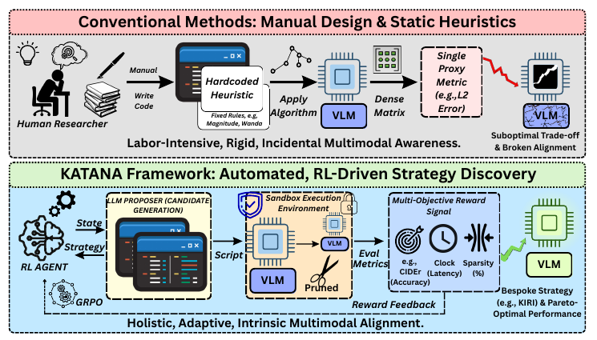
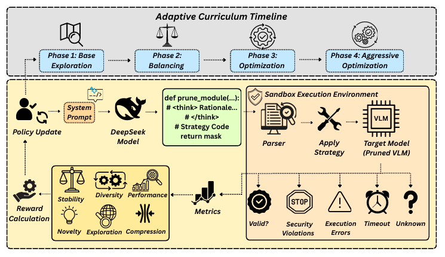

<div align="center">

# ⚔️ KATANA

### Knowledge-Aligned Topology-Aware Neural Agents for<br/>RL-Driven Vision-Language Model Compression

**ECCV 2026**

[Nafew Azim](mailto:nafew.azim@northsouth.edu)<sup>1</sup> · [Mir Robab Warish Ali](mailto:mir.ali@northsouth.edu)<sup>1</sup> · [Fuad Rahman](mailto:fuad@apurbatech.com)<sup>2</sup> · [Nabeel Mohammed](mailto:nabeel.mohammed@northsouth.edu)<sup>1</sup>

<sup>1</sup> North South University&nbsp;&nbsp;·&nbsp;&nbsp;<sup>2</sup> Apurba Technologies

[](https://eccv.ecva.net/)
[](LICENSE)
[](https://www.python.org/)
[](https://pytorch.org/)

[**Highlights**](#-highlights) · [**Method**](#-how-katana-works) · [**Results**](#-main-results) · [**Installation**](#-installation) · [**Quick Start**](#-quick-start) · [**Citation**](#-citation)



</div>

---

**KATANA** is a reinforcement learning framework that **autonomously discovers executable pruning algorithms** for vision-language models. Instead of hand-crafting yet another importance heuristic, an LLM-driven agent *writes complete Python pruning programs*, which are safely evaluated inside an isolated sandbox and refined via **Group Relative Policy Optimization (GRPO)** under a synthesized multi-objective reward.

Its flagship discovery, **KIRI** (*Kernel-Integrated Reconstruction Iterator*), couples a cubic sparsity schedule with a novel Dual-Norm Activation (DNA) importance metric. At **70% unstructured sparsity**, KIRI delivers a measured **2.8× inference speedup** while outperforming **16 state-of-the-art baselines** across four VLM architectures.

## 📰 News

- **2026** · KATANA is accepted to **ECCV 2026**.
- **2026** · Code release of the KATANA discovery framework.

## ✨ Highlights

- **Automated algorithm discovery** — pruning-algorithm design framed as executable program synthesis: the agent jointly discovers scoring metrics *and* scheduling logic end-to-end, moving beyond both manual heuristics and hyperparameter-only search.
- **Isolated sandbox execution** — every candidate program passes security screening, AST validation, quarantined execution, and mask validation before it may touch a model.
- **Multi-objective reward** — bounded sigmoids over task accuracy (CIDEr) and per-token decode latency, momentum-augmented compression, plus novelty / diversity / stability incentives shifted by an adaptive 4-phase curriculum.
- **Multimodal-aware by design** — the discovered strategy protects the delicate cross-modal projections that human-engineered metrics (Magnitude, Wanda, SparseGPT) systematically destroy.

## 🔬 How KATANA Works

<div align="center">

</div>

1. **Propose** — the LLM proposer receives a structured prompt (baseline pruning function, historical performance metrics, task objectives) and emits a candidate program: a `<think>` mathematical rationale followed by an executable ` ```python ` block defining `prune_module(weight, activations, sparsity, step, total_steps)`. The generative system prompt ships **verbatim** in [`src/katana/agent/prompts.py`](src/katana/agent/prompts.py), with the curriculum phase injected each iteration.
2. **Validate & Execute** — the [Sandbox Execution Environment](src/katana/sandbox/) statically screens the code, compiles it with **RestrictedPython**, smoke-tests the candidate on dummy tensors under a wall-clock timeout, then applies the generated masks to every eligible linear layer of a deep copy of the calibration model (embeddings and output heads are exempt) and verifies a forward pass. Failures map to staged penalties (security −5.0, validation, execution, timeout).
3. **Reward** — the [multi-objective reward system](src/katana/rewards/) scores valid candidates on performance, compression, novelty (four-dimensional similarity vs. a 10,000-strategy memory, AST-normalised to defeat trivial renaming), exploration, diversity, and stability — with weights shifted by the [adaptive curriculum](src/katana/rewards/curriculum.py) across four phases, from Base Exploration to Aggressive Optimization.
4. **Update** — GRPO turns the reward into policy gradients on the proposer's LoRA adapters. Gradient-guided updates are what let the search scale to 1,000 iterations without combinatorial collapse (random search without GRPO lands 8.4 CIDEr lower).

## 📊 Main Results

**Image captioning on MSCOCO (Karpathy split) at 70% sparsity.** CIDEr (↑, scaled by 100; greedy decoding); ± is std. dev. across 3 seeds, reported for KIRI and the strongest baseline. **Bold** = best, <ins>underline</ins> = second best.

| Method | LLaVA-1.5-7B | BLIP-2 | Qwen2.5-7B | Llama-3.2-Vision |
|:---|:---:|:---:|:---:|:---:|
| *Dense (unpruned)* | *91.8* | *92.5* | *92.4* | *93.8* |
| **Traditional Unstructured & Semi-Structured** | | | | |
| Magnitude | 40.4 | 20.4 | 64.7 | 67.2 |
| Wanda | 77.2 | 66.4 | 71.2 | 73.8 |
| SparseGPT | 36.8 | 74.4 | 75.8 | 78.5 |
| LLM-Pruner | 76.8 | 84.1 | 79.5 | 82.3 |
| GMP | 70.5 | 77.2 | 72.9 | 75.4 |
| RIA | 69.9 | 59.5 | 81.3 | 84.2 |
| **VLM-Specific & Token-Aware** | | | | |
| Eff-LLaVA | 81.0 | 82.5 | 85.2 | 88.0 |
| AutoPrune | 83.2 | 84.0 | 86.5 | 89.3 |
| ToMe | 80.2 | 81.8 | 84.8 | 87.5 |
| FastV | 79.8 | 81.5 | 84.5 | 87.2 |
| SparseVLM | 82.1 | 83.5 | 86.0 | 88.8 |
| FasterVLM | 81.3 | 82.8 | 85.4 | 88.2 |
| **Adaptive & Hybrid** | | | | |
| SCOPE | 82.8 | 84.2 | 86.3 | 89.0 |
| TopV | 83.0 | 84.5 | 86.6 | 89.4 |
| FEATHER | 82.5 | 84.0 | 86.1 | 88.9 |
| GSOP | <ins>83.3 ± 0.3</ins> | <ins>84.8 ± 0.3</ins> | <ins>86.8 ± 0.3</ins> | <ins>89.6 ± 0.3</ins> |
| **KIRI (Ours)** | **84.6 ± 0.2** | **85.4 ± 0.3** | **87.9 ± 0.2** | **90.5 ± 0.3** |
| *Margin over GSOP* | *+1.3* | *+0.6* | *+1.1* | *+0.9* |

**Inference efficiency at 70% sparsity** (per-token decode, batch 1, 512-token prefill; unstructured methods run on cuSPARSE v11.7 with SparseTIR-style fused kernels):

| | Dense | KIRI | Speedup |
|:---|:---:|:---:|:---:|
| NVIDIA A100 (40GB) | 0.17 s | 0.060 ± 0.002 s | **2.8×** |
| NVIDIA RTX 4090 (edge) | 71 ms | 32 ms | **2.2×** |

Underneath, the decode phase is memory-bandwidth bound: KIRI's CSR-compressed weights cut HBM reads from ~910 GB/s to ~318 GB/s, lifting decode throughput from 5.8 to 16.6 tok/s. Beyond generative metrics, KIRI preserves non-generative visual grounding: **1478.2 on MME** vs. the 1510.5 dense baseline (97.9% retained), and **84.6 F1 on POPE** hallucination probing vs. 86.3 dense.

<details>
<summary><b>Cross-dataset generalization — Flickr30k & NoCaps, all four architectures (70% sparsity)</b></summary>
<br/>

CIDEr (↑); ± is std. dev. across 3 seeds, reported for KIRI and the top baseline. **Bold** = best, <ins>underline</ins> = second best. Selected methods shown — exhaustive tables (all 16 baselines, all five metrics) are in the paper.

**Flickr30k**

| Method | LLaVA-1.5-7B | BLIP-2 | Qwen2.5-7B | Llama-3.2-Vision |
|:---|:---:|:---:|:---:|:---:|
| *Dense (unpruned)* | *56.3* | *60.1* | *65.2* | *68.4* |
| Wanda | 38.5 | 43.2 | 48.2 | 51.0 |
| SparseVLM | 49.0 | 53.5 | 59.1 | 62.0 |
| SCOPE | 49.5 | 54.1 | 59.8 | 62.8 |
| TopV | 49.8 | 54.5 | 60.2 | 63.2 |
| GSOP | <ins>50.2 ± 0.4</ins> | <ins>55.1 ± 0.3</ins> | <ins>61.0 ± 0.3</ins> | <ins>64.1 ± 0.4</ins> |
| **KIRI (Ours)** | **51.5 ± 0.3** | **56.8 ± 0.4** | **62.5 ± 0.3** | **65.8 ± 0.4** |

**NoCaps**

| Method | LLaVA-1.5-7B | BLIP-2 | Qwen2.5-7B | Llama-3.2-Vision |
|:---|:---:|:---:|:---:|:---:|
| *Dense (unpruned)* | *50.9* | *55.2* | *60.5* | *64.2* |
| Wanda | 32.1 | 38.4 | 41.8 | 44.5 |
| SparseVLM | 43.5 | 48.9 | 53.2 | 57.3 |
| SCOPE | 44.1 | 49.5 | 53.8 | 58.1 |
| TopV | 44.4 | 49.9 | 54.2 | 58.5 |
| GSOP | <ins>45.0 ± 0.4</ins> | <ins>50.6 ± 0.4</ins> | <ins>55.1 ± 0.4</ins> | <ins>59.4 ± 0.4</ins> |
| **KIRI (Ours)** | **46.4 ± 0.3** | **52.1 ± 0.3** | **56.8 ± 0.3** | **61.2 ± 0.4** |

</details>

<details>
<summary><b>Component ablations — emergent, non-additive synergy (LLaVA-1.5-7B, MSCOCO, 70% sparsity)</b></summary>
<br/>

| Variant | CIDEr | Δ CIDEr | VQA |
|:---|:---:|:---:|:---:|
| **Full KIRI (F)** | **84.6** | — | **78.5** |
| Linear schedule (S<sub>L</sub>) | 78.2 | −6.4 | 65.4 |
| Constant schedule (S<sub>C</sub>) | 76.5 | −8.1 | 59.8 |
| DNA w/o structural norms (D<sub>N</sub>) | 80.1 | −4.5 | 71.0 |
| DNA w/o activations (D<sub>A</sub>) | 79.5 | −5.1 | 69.2 |
| Magnitude only (D<sub>M</sub>) | 77.3 | −7.3 | 63.5 |
| w/o reconstruction (R) | 81.3 | −3.3 | 72.9 |

The cubic schedule mathematically stabilises the aggressive DNA pruning: profiling shows it reduces abrupt activation-variance spikes by 15% during high-sparsity transitions — a cross-modal sensitivity dynamic that human-engineered heuristics entirely missed.

</details>

<details>
<summary><b>Framework ablations — why GRPO, novelty, and the curriculum matter (1,000 iterations)</b></summary>
<br/>

| Variant | CIDEr | Novelty Score | Final Reward |
|:---|:---:|:---:|:---:|
| **Full Framework (F)** | **84.6 ± 0.3** | **0.72 ± 0.04** | **6.8 ± 0.2** |
| w/o novelty reward (N) | 79.8 ± 0.5 | 0.41 ± 0.05 | 5.9 ± 0.3 |
| w/o diversity reward (D) | 80.4 ± 0.4 | 0.58 ± 0.04 | 6.1 ± 0.2 |
| w/o curriculum (C) | 77.9 ± 0.6 | 0.52 ± 0.05 | 5.7 ± 0.3 |
| w/o GRPO — random search (G) | 76.2 ± 0.7 | 0.48 ± 0.06 | 5.4 ± 0.4 |

</details>

<details>
<summary><b>Sparsity–accuracy Pareto frontier (LLaVA-1.5, MSCOCO, 30–90% sparsity)</b></summary>
<br/>

Evaluated with standard beam search (contrasting the greedy decoding used in the main table for search efficiency); 3 seeds, σ < 1.2.

| Sparsity | CIDEr | Decode speedup |
|:---:|:---:|:---:|
| 0% (dense) | 128.2 | 1.0× |
| 30% | 126.8 | 1.2× |
| 70% | 118.4 | 2.8× |
| 80% | 109.7 | 3.5× |
| 90% | 92.1 | 4.1× |

At 90% sparsity, all baseline heuristics collapse below 85 CIDEr while KIRI remains viable at 92.1.

</details>

**Search efficiency.** The full 1,000-iteration discovery costs ~480 A100 GPU-hours as a one-time fixed cost — but 100 iterations (~48 GPU-hours) already surpass most manual baselines at 78.2 CIDEr, and 300 iterations (~144 GPU-hours) secure 97% of final performance at 82.5 CIDEr. A CodeLlama-7B proxy proposer trims the full search to roughly 288 GPU-hours without significant degradation.

## 🛠️ Installation

```bash
git clone https://github.com/nafew-azim/KATANA.git
cd KATANA

# Full RL discovery stack (GPU; Unsloth + TRL/GRPO)
pip install -e ".[search]"
```

## ⚡ Quick Start

```bash
python scripts/run_search.py --config configs/search.yaml
```

The config ships with paper-scale defaults (DeepSeek-Coder-V2-Lite-Instruct proposer, LoRA r=64, 1,000 GRPO iterations) and commented smoke-test values that verify the full propose → sandbox → reward → update loop on a single GPU in minutes.

To build the official search prompt for a custom run programmatically:

```python
from katana.agent import build_system_prompt, build_task_prompt, build_grpo_dataset

system = build_system_prompt(phase=0)           # injects the curriculum phase
task = build_task_prompt(target_sparsity=0.7)   # baseline function + history
dataset = build_grpo_dataset(task, system_prompt=system)
```

## 📁 Repository Structure

```
KATANA/
├── configs/
│   └── search.yaml               # RL discovery search (paper-scale + smoke-test)
├── scripts/
│   └── run_search.py             # end-to-end GRPO discovery pipeline
└── src/katana/
    ├── agent/                    # LLM proposer
    │   ├── policy.py             #   4-bit proposer + LoRA (Unsloth)
    │   ├── prompts.py            #   generative system prompt + task templates
    │   └── parser.py             #   <think> + ```python completion parsing
    ├── sandbox/                  # Isolated Sandbox Execution Environment
    │   ├── security.py           #   static security screening
    │   └── executor.py           #   AST validation → quarantined exec → masking → metrics
    ├── rewards/                  # Multi-objective reward synthesis
    │   ├── curriculum.py         #   4-phase adaptive curriculum (Fig. 2)
    │   └── system.py             #   performance/compression/novelty/diversity/stability
    ├── training/                 # GRPO loop
    │   ├── grpo.py               #   trainer assembly
    │   ├── reward_fn.py          #   completions → sandbox → reward bridge
    │   └── callbacks.py          #   checkpointing, dashboards, search reports
    └── utils/logging.py
```

## 📖 Citation

```bibtex
@inproceedings{azim2026katana,
  title     = {{KATANA}: Knowledge-Aligned Topology-Aware Neural Agents for {RL}-Driven Vision-Language Model Compression},
  author    = {Azim, Nafew and Ali, Mir Robab Warish and Rahman, Fuad and Mohammed, Nabeel},
  booktitle = {European Conference on Computer Vision (ECCV)},
  year      = {2026}
}
```

## 🤝 Acknowledgements

This work builds on the open-source ecosystem around [Unsloth](https://github.com/unslothai/unsloth), [TRL](https://github.com/huggingface/trl), and [Transformers](https://github.com/huggingface/transformers), and is inspired by LLM-driven algorithm-discovery frameworks such as Eureka and FunSearch.

## 📜 License

Released under the [MIT License](LICENSE).
